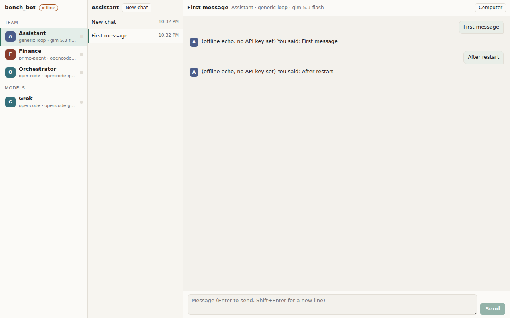

# bench_bot

**A desktop chat app where each contact is an AI bot — learning build, our own code.**

A local-first workspace where named bots are contacts: each bot gets its own thread, its own
workspace, its own tools, and a **swappable harness** (OpenCode, Prime Agent, or our own generic
agent loop — open-source harnesses only). Models come from an OpenCode Go subscription by default. Bots can delegate to each other.

**Formula:** `Bot = identity + instructions + model + harness + tools`

## Status

Phase 0 done. No application code yet. The build follows [`plan.md`](plan.md), one phase at a time.

- [x] `CLAUDE.md` — the build instruction (read this first)
- [x] `docs/openbot-map.md` — architectural map of the reference project
- [x] `docs/reference-notes.md` — OpenMausBot, deepseek-harness, prime-agent
- [x] `docs/ARCHITECTURE.md` — our own design

## How to run

Needs **Node 22.13 or newer** and **pnpm 10** (on a Mac: `brew install node pnpm`, or use
`corepack enable`).

```bash
pnpm install      # install tools
pnpm test         # run the tests
pnpm typecheck    # check the TypeScript types
pnpm lint         # check formatting and common mistakes
pnpm format       # fix formatting
```

For real AI answers: copy `.env.example` to `.env` and put your OpenCode Go key in it.
`.env` is never committed. Then ask our own loop one question:

```bash
pnpm ask "What is the capital of France?"
pnpm ask --model deepseek-v4-flash "Hello"   # pick another OpenCode Go model
```

Without a key, `pnpm ask` answers in offline echo mode.

## Run the app

```bash
pnpm build        # build the chat window once
pnpm start        # start the server, then open http://127.0.0.1:8787
pnpm dev          # or: server + live-reloading window on http://127.0.0.1:5173
pnpm dev:desktop  # or: the Mac app window (Electron)
```



## Why

- Learn the product shape of OpenBot / OpenMausBot by building it ourselves.
- OpenBot ships under PolyForm Noncommercial 1.0.0, so its code must never be copied.
  bench_bot's own license is not chosen yet.
- Same product shape, different code, different UI. Read the references, never copy them.

## References (read-only, cloned to `/tmp` during Phase 0)

| Reference | License | Reuse code? |
|---|---|---|
| `nightly-labs/openbot` | PolyForm Noncommercial 1.0.0 | **No** |
| `milind-soni/OpenMausBot` | Apache-2.0 | with attribution |
| `deepseek-ai/deepseek-harness` | MIT | with attribution |
| `PrimeIntellect-ai/prime-agent` | MIT | with attribution |

Clean-room rule: read the architecture, write our own. No source, CSS, assets or component trees.

## Intended layout

```
kernel/       tiny DI: register service, get service
services/     interfaces only
providers/    implementations
harnesses/    generic-loop, opencode, prime-agent
bots/         yaml or json bot defs
apps/api/     HTTP + SSE
apps/web/     sidebar roster + thread + composer
apps/desktop/ Electron shell around api + web
```

## Working rules

Small commits · interfaces before implementations · no god-object `AgentService` ·
prefer a working generic loop over a perfect CLI integration. Full list in `CLAUDE.md`.
